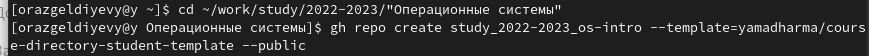
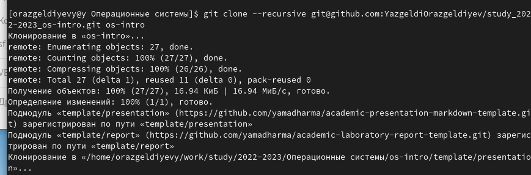
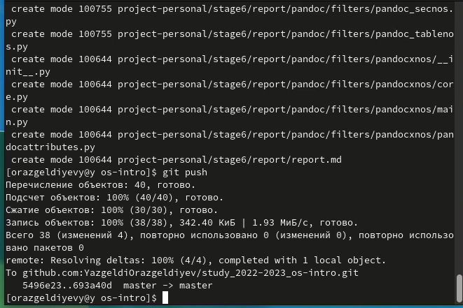

---
## Front matter
title: "Лабораторная работа № 3"
subtitle: "Операционные системы"
author: "Оразгелдиев Язгелди"

## Generic otions
lang: ru-RU
toc-title: "Содержание"

## Bibliography
bibliography: bib/cite.bib
csl: pandoc/csl/gost-r-7-0-5-2008-numeric.csl

## Pdf output format
toc: true # Table of contents
toc-depth: 2
lof: true # List of figures
lot: true # List of tables
fontsize: 12pt
linestretch: 1.5
papersize: a4
documentclass: scrreprt
## I18n polyglossia
polyglossia-lang:
  name: russian
  options:
	- spelling=modern
	- babelshorthands=true
polyglossia-otherlangs:
  name: english
## I18n babel
babel-lang: russian
babel-otherlangs: english
## Fonts
mainfont: PT Serif
romanfont: PT Serif
sansfont: PT Sans
monofont: PT Mono
mainfontoptions: Ligatures=TeX
romanfontoptions: Ligatures=TeX
sansfontoptions: Ligatures=TeX,Scale=MatchLowercase
monofontoptions: Scale=MatchLowercase,Scale=0.9
## Biblatex
biblatex: true
biblio-style: "gost-numeric"
biblatexoptions:
  - parentracker=true
  - backend=biber
  - hyperref=auto
  - language=auto
  - autolang=other*
  - citestyle=gost-numeric
## Pandoc-crossref LaTeX customization
figureTitle: "Рис."
tableTitle: "Таблица"
listingTitle: "Листинг"
lofTitle: "Список иллюстраций"
lotTitle: "Список таблиц"
lolTitle: "Листинги"
## Misc options
indent: true
header-includes:
  - \usepackage{indentfirst}
  - \usepackage{float} # keep figures where there are in the text
  - \floatplacement{figure}{H} # keep figures where there are in the text
---

# Цель работы

-Изучить идеологию и применение средств контроля версий.
-Освоить умения по работе с git.

# Задание

1. Установка программного обеспечения
   1.1. Установка git
   1.2. Установка gh
2. Базовая настройка git
3. Создайте ключи ssh
4. Создайте ключи pgp
5. Настройка github
6. Добавление PGP ключа в GitHub
7. Настройка автоматических подписей коммитов git
8. Настройка gh
9. Шаблон для рабочего пространства
10. Сознание репозитория курса на основе шаблона
11. Настройка каталога курса
# Выполнение лабораторной работы

Мы уже ранее подключали гитхаб и создавали необходимые ключи для работы с виртуальной машиной. Поэтому нам нужно выполнить лишь пару пунктов.
1. Создание папки "Операционные системы" 

{#fig:001 width=70%}

2. Создание своего репозитория и клонирование шаблона 

{#fig:002 width=70%}

{#fig:003 width=70%}

3. Удаление лишних файлов и создание каталогов

{#fig:004 width=70%}

4. Отправка файлов на сервер GitHub

{#fig:005 width=70%}

# Выводы

- Мы изучили идеологию и применение средств контроля версий.
- Освоить умения по работе с git.
