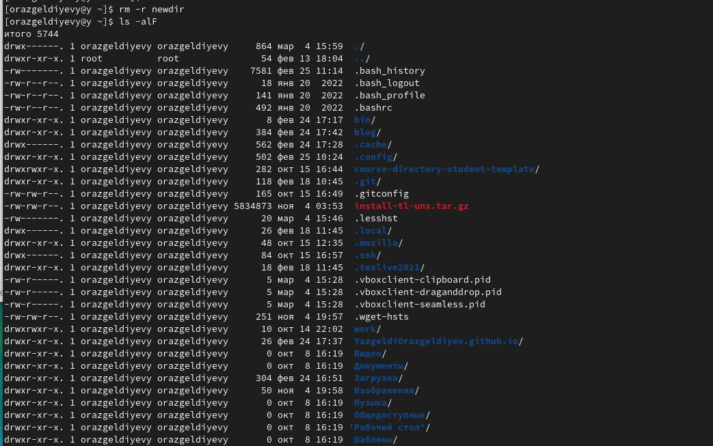

---
## Front matter
title: "Лабораторная работа № 4"
subtitle: "Операционные системы"
author: "Оразгелдиев Язгелди"

## Generic otions
lang: ru-RU
toc-title: "Содержание"

## Bibliography
bibliography: bib/cite.bib
csl: pandoc/csl/gost-r-7-0-5-2008-numeric.csl

## Pdf output format
toc: true # Table of contents
toc-depth: 2
lof: true # List of figures
lot: true # List of tables
fontsize: 12pt
linestretch: 1.5
papersize: a4
documentclass: scrreprt
## I18n polyglossia
polyglossia-lang:
  name: russian
  options:
	- spelling=modern
	- babelshorthands=true
polyglossia-otherlangs:
  name: english
## I18n babel
babel-lang: russian
babel-otherlangs: english
## Fonts
mainfont: PT Serif
romanfont: PT Serif
sansfont: PT Sans
monofont: PT Mono
mainfontoptions: Ligatures=TeX
romanfontoptions: Ligatures=TeX
sansfontoptions: Ligatures=TeX,Scale=MatchLowercase
monofontoptions: Scale=MatchLowercase,Scale=0.9
## Biblatex
biblatex: true
biblio-style: "gost-numeric"
biblatexoptions:
  - parentracker=true
  - backend=biber
  - hyperref=auto
  - language=auto
  - autolang=other*
  - citestyle=gost-numeric
## Pandoc-crossref LaTeX customization
figureTitle: "Рис."
tableTitle: "Таблица"
listingTitle: "Листинг"
lofTitle: "Список иллюстраций"
lotTitle: "Список таблиц"
lolTitle: "Листинги"
## Misc options
indent: true
header-includes:
  - \usepackage{indentfirst}
  - \usepackage{float} # keep figures where there are in the text
  - \floatplacement{figure}{H} # keep figures where there are in the text
---

# Цель работы

Приобретение практических навыков взаимодействия пользователя с системой по-
средством командной строки.

# Задание

1. Определите полное имя вашего домашнего каталога. Далее относительно этого ката-
лога будут выполняться последующие упражнения.
2. Выполните следующие действия:
2.1. Перейдите в каталог /tmp.
2.2. Выведите на экран содержимое каталога /tmp. Для этого используйте команду ls
с различными опциями. Поясните разницу в выводимой на экран информации.
2.3. Определите, есть ли в каталоге /var/spool подкаталог с именем cron?
2.4. Перейдите в Ваш домашний каталог и выведите на экран его содержимое. Опре-
делите, кто является владельцем файлов и подкаталогов?
3. Выполните следующие действия:
3.1. В домашнем каталоге создайте новый каталог с именем newdir.
3.2. В каталоге ~/newdir создайте новый каталог с именем morefun.
3.3. В домашнем каталоге создайте одной командой три новых каталога с именами
letters, memos, misk. Затем удалите эти каталоги одной командой.
3.4. Попробуйте удалить ранее созданный каталог ~/newdir командой rm. Проверьте,
был ли каталог удалён.
3.5. Удалите каталог ~/newdir/morefun из домашнего каталога. Проверьте, был ли
каталог удалён.
4. С помощью команды man определите, какую опцию команды ls нужно использо-
вать для просмотра содержимое не только указанного каталога, но и подкаталогов,
входящих в него.
5. С помощью команды man определите набор опций команды ls, позволяющий отсорти-
ровать по времени последнего изменения выводимый список содержимого каталога
с развёрнутым описанием файлов.
6. Используйте команду man для просмотра описания следующих команд: cd, pwd, mkdir,
rmdir, rm. Поясните основные опции этих команд.
7. Используя информацию, полученную при помощи команды history, выполните мо-
дификацию и исполнение нескольких команд из буфера команд.

# Теоретическое введение

В операционной системе типа Linux взаимодействие пользователя с системой обычно
осуществляется с помощью командной строки посредством построчного ввода команд. При этом обычно используется командные интерпретаторы языка shell: /bin/sh;
/bin/csh; /bin/ksh.

# Выполнение лабораторной работы
{#fig:001 width=70%}

1. Я перешел в каталог tmp и вывел все содержимое на экран

{#fig:001 width=70%}

{#fig:002 width=70%}

{#fig:003 width=70%}

2. Определил, что  в каталоге /var/spool нет подкаталога с именем cron

{#fig:004 width=70%}

3. Перешел в домашний каталог и вывел все его содержимое. Владельцем каталога является пользователь orazgeldiyevyy

{#fig:005 width=70%}

4. В домашнем каталоге создал каталог newdir

{#fig:006 width=70%}

5. В каталоге ~/newdir создал новый каталог с именем morefun.

{#fig:007 width=70%}

6. В домашнем каталоге создали одной командой три новых каталога с именами
letters, memos, misk. Затем удалили эти каталоги одной командой.

{#fig:008 width=70%}

{#fig:009 width=70%}

7. Удалите каталог ~/newdir/morefun из домашнего каталога. Проверьте, был ли
каталог удалён.

{#fig:010 width=70%}

8. С помощью команды man определил,0 какую опцию команды ls нужно использовать для просмотра содержимое не только указанного каталога, но и подкаталогов,
входящих в него(man ls -list).

{#fig:011 width=70%}

9. Использовал команду man для просмотра описания следующих команд: cd, pwd, mkdir,
rmdir, rm.

{#fig:012 width=70%}

10. Используя информацию, полученную при помощи команды history, выполнил модификацию и исполнение нескольких команд из буфера команд.

{#fig:0113 width=70%}

{#fig:014 width=70%}

# Выводы

Приобрел практические навыки взаимодействия пользователя с системой посредством командной строки.

Контрольные вопросы.

1. Что такое командная строка?
- Командная строка (консоль или Терминал) – это специальная программа, которая
позволяет управлять компьютером путем ввода текстовых команд с клавиатуры.

2. При помощи какой команды можно определить абсолютный путь текущего каталога? Приведите пример.
- pwd (аббревиатура от print working directory) возвращает полный путь текущего каталога
командной оболочки, естественно, именно той командной оболочки, при помощи которой
была выполнена команда pwd.

3. При помощи какой команды и каких опций можно определить только тип файлов и их имена в
текущем каталоге? Приведите примеры.
- Для просмотра содержимого каталога используется команда ls. Название этой команды
является сокращением слов list files и с помощью опции -F. 

{#fig:015 width=70%}

4. Каким образом отобразить информацию о скрытых файлах? 
- C помощью команды ls и опции -alF

{#fig:003 width=70%}

5. При помощи каких команд можно удалить файл и каталог? Можно ли это сделать одной и той же
командой? Приведите примеры.
- При помощи команды -rm и ее опций. Нет, это нельзя сделать, ведь командой rm без опций
нельзя удалить каталог, только с опцией -r или rmdir(только в том случае, если каталог пустой) 

6. Каким образом можно вывести информацию о последних выполненных пользователем
командах? работы? 
- C помощью команды history.

7. Как воспользоваться историей команд для их модифицированного выполнения? Приведите
примеры. 
- Можно модифицировать команду из выведенного на экран списка при помощи следующей конструкции: !<номер_команды>:s/<что_меняем>/<на_что_меняем>

9. Дайте определение и приведите примера символов экранирования. 
- Экранирование символов — замена в тексте управляющих символов на соответствующие текстовые подстановки.

10. Охарактеризуйте вывод информации на экран после выполнения команды ls с опцией l.
- О каждом файле и каталоге будет выведена следующая информация: – тип файла, – право
доступа, – число ссылок, – владелец, – размер, – дата последней ревизии, – имя файла или
каталога.

11. Что такое относительный путь к файлу? Приведите примеры использования относительного и
абсолютного пути при выполнении какой-либо команды. 
- Aбcoлютный путь нeизмeнeн, нaпpимep, /home/robin/Documents и интepпpeтиpуeтcя oдинaкoвo нeзaвиcимo oт вaшeй paбoчeй пaпки, в тo вpeмя кaк oтнocитeльный путь нe включaeт oднo или нecкoлькo имeн poдитeльcкиx пaпoк,
зaмeняя иx либo oбoзнaчeниeм .., либo ccылaяcь нa фaйлы и пaпки внутpи тeкущeй пaпки. 

12. Как получить информацию об интересующей вас команде?
- С помощью команды man или опции --help

13. Какая клавиша или комбинация клавиш служит для автоматического дополнения вводимых
команд?
- Tab — автоматическое завершение набора имени файла, директории или команды.
Данная функция относится к одной из наиболее полезных в терминале. Во время ввода имени файла, каталога или команды достаточно нажать Tab, после чего ввод должен автоматически завершиться. Если таковой возможности нет, в окне терминала будут отображены всевозможные способы дополнения, позволяя пользователю дальше печатать и нажимать Tab для завершения ввода.

