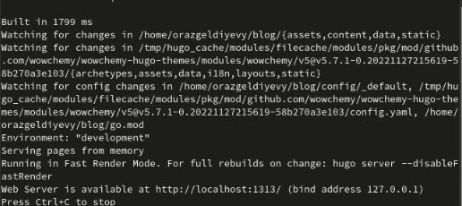
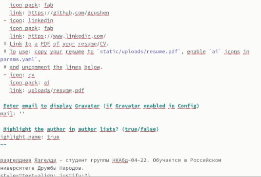
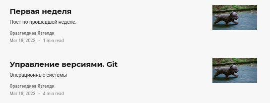
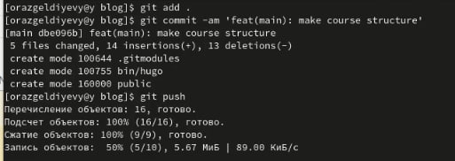

---
## Front matter
title: "Индивидуальный проект. Этап 2"
subtitle: "Операционные системы"
author: "Оразгелдиев Язгелди"

## Generic otions
lang: ru-RU
toc-title: "Содержание"

## Bibliography
bibliography: bib/cite.bib
csl: pandoc/csl/gost-r-7-0-5-2008-numeric.csl

## Pdf output format
toc: true # Table of contents
toc-depth: 2
lof: true # List of figures
lot: true # List of tables
fontsize: 12pt
linestretch: 1.5
papersize: a4
documentclass: scrreprt
## I18n polyglossia
polyglossia-lang:
  name: russian
  options:
	- spelling=modern
	- babelshorthands=true
polyglossia-otherlangs:
  name: english
## I18n babel
babel-lang: russian
babel-otherlangs: english
## Fonts
mainfont: PT Serif
romanfont: PT Serif
sansfont: PT Sans
monofont: PT Mono
mainfontoptions: Ligatures=TeX
romanfontoptions: Ligatures=TeX
sansfontoptions: Ligatures=TeX,Scale=MatchLowercase
monofontoptions: Scale=MatchLowercase,Scale=0.9
## Biblatex
biblatex: true
biblio-style: "gost-numeric"
biblatexoptions:
  - parentracker=true
  - backend=biber
  - hyperref=auto
  - language=auto
  - autolang=other*
  - citestyle=gost-numeric
## Pandoc-crossref LaTeX customization
figureTitle: "Рис."
tableTitle: "Таблица"
listingTitle: "Листинг"
lofTitle: "Список иллюстраций"
lotTitle: "Список таблиц"
lolTitle: "Листинги"
## Misc options
indent: true
header-includes:
  - \usepackage{indentfirst}
  - \usepackage{float} # keep figures where there are in the text
  - \floatplacement{figure}{H} # keep figures where there are in the text
---

# Цель работы

Обучение изменению структуры и данных собственного сайта.

# Задание

1. Добавить к сайту данные о себе.
2. Разместить фотографию владельца сайта.
3. Разместить краткое описание владельца сайта (Biography).
4. Добавить информацию об интересах (Interests).
5. Добавить информацию от образовании (Education).
6. Сделать пост по прошедшей неделе.
7. Добавить пост на тему по выбору:
- Управление версиями. Git.
- Непрерывная интеграция и непрерывное развертывание (CI/CD).

# Выполнение лабораторной работы

1. Открываю терминал в папке blog, ввожу команду hugo server и жду загрузку сервера.

{#fig:001 width=70%}

2. Позже открываю папку blog/content/authors/admin и открываешь md файл _index. Меняю данные в документе на свои. Добавляю информацию о себе. Еще добавляю два поста о себе и о Git.

{#fig:002 width=70%}

{#fig:002 width=70%}

3. Закрываю тестовый сервер локальный и запускаю уже сам hugо. Ввожу команды git add . , git commit, git push для папки blog

{#fig:003 width=70%}

4. Так же меняю данные в папке public

{#fig:001 width=70%}

# Выводы

Я научился изменять структуру и данные собственного сайта через терминал на виртуальной машине Линукс.
